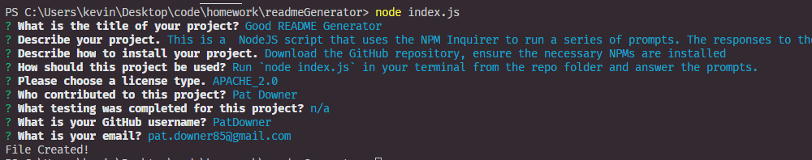

# Good README Generator

  -------
  
  ## Table of Contents

  - [Description](#description)
  - [Installation](#installation)
  - [Usage](#usage)
  - [License](#license)
  - [Contributing](#contributing)
  - [Tests](#tests)
  - [Questions](#questions)

  ## Description:
  
  This is a  NodeJS script that uses the NPM Inquirer to run a series of prompts. The responses to the prompts are then used to generate a README file.
  

  ## Installation:
  
  Download the GitHub repository, ensure the necessary NPMs are installed
  

  ## Usage:
  
  Run `node index.js` in your terminal from the repo folder and answer the prompts.

  

  Watch a [video walk-through](https://drive.google.com/file/d/1cw0jETUCIuGLl6TWD92i3jn1ZfaxGc6C/view) for how to use the app.
  

  ## Contributing:
  
  Pat Downer
  

  ## Testing:
  
  n/a
  

  ## Questions:
  
  Github Username: [PatDowner](https://github.com/PatDowner)
  
  Contact me via email at: [pat.downer85@gmail.com](mailto:pat.downer85@gmail.com)
  